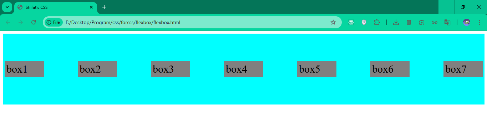

# CSS Flexbox

Simple Flexbox using html and css
## Features
- Basic Flexbox properties
- Responsive design
- Layout alignment

### Screenshot

## How to View:
1. Clone the repository or download the files.  
2. Open index.html file in your browser.
